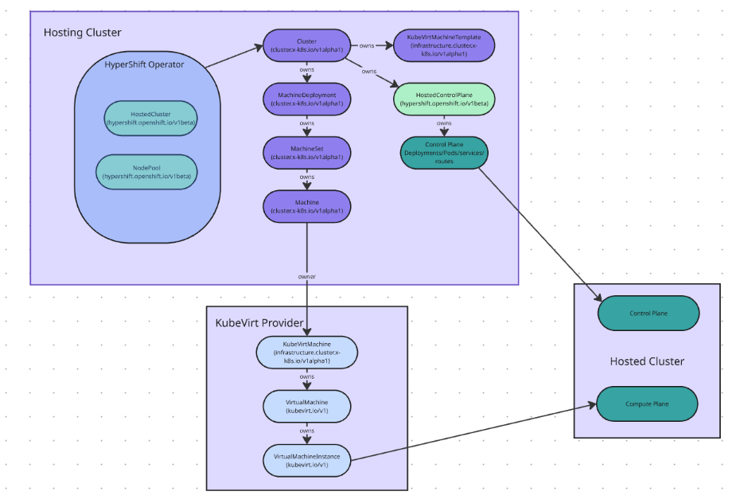

# Deploying OpenShift on OpenShift with Hosted Control Planes

This document outlines a validated pattern for deploying OpenShift on OpenShift using Hosted Control Planes ( HCP ). This solution provides a scalable and efficient method for managing multiple OpenShift clusters.

# 1\. Executive Summary

One of the most common patterns in deploying Openshift clusters is to build the clusters on top of a virtualization environment. Such an architecture allows for all of the advantages of VM-based computing, including:

* Flexibility to scale up and scale down  
* Efficiency through VM rightsizing, especially for control plane (master) nodes  
* Rapid deployment of clusters  
* Robust HA and DR options  
* Abstraction from physical hardware complexity  
* Robust third-party networking and storage offerings

The release of OpenShift virtualization 4+ years ago, and the industry developments regarding legacy virtualization (VMware/Broadcom) have given strong incentive for building Opebshift clusters on Opebshift virtualization. However, building OpenShift virtualization clusters presents a new challenge for architects:

1. Openshift clusters require 3 master nodes for the control plane  
2. Virtualization must be run on bare-metal machines for supportable and performant production environments.

Due to these two requirements, a standalone Openshift virtualization cluster must dedicate 3 physical servers to the control plane. In a typical 30- to 40-node cluster, that results in 8-10% of total cluster capacity being dedicated to the control plane. Moreover, the physical machines used in virtual infrastructure tend to be very large and expensive, so an 8-10% overhead is quite high.

There are several architectures which can be used to reduce this control plane inefficiency. They are enumerated in the table below, with pros and cons:

| Architecture | Pros | Cons |
| :---- | :---- | :---- |
| “Rightsizing” physical nodes (using smaller/cheaper nodes for the control plane) | Simplicity | “Rightsized” nodes are not usually available. Typically requires custom purchases  |
| VM-based control plane (control plane nodes in external VMs) | Efficiency | Complexity; requires an external virtualization environment |
| Hosted Control Plane (HCP) | More efficient than VM-based control plane Almost as simple as right-sized control plane Provides for rapid cluster deployment | Requires an external OpenShift “hosting cluster” Lack of operational familiarity (new tool) |

This document will focus on the third architectural option: Hosted Control Place (HCP). 

# 2\. Introduction to OpenShift on OpenShift virtualization with Hosted Control Planes

Terminology 

* **Hosting Management Plane / Foundation Cluster** ( the OCP Cluster which will host the control planes ( as pods ) of the hosted clusters.  
* **Hosted Cluster:** An OCP cluster which has its control plane in an HCP architecture.  
* **Hosted Data Plane** ( the OCP worker nodes of an OCP cluster that is under the control of a Hosted Control Plane )  
* **Hosted Control Plane** ( the container-based OCP control 78+ pods that make up the control plane of a HCP Hosted Cluster )

## 2.1 What does it mean by running OpenShift on OpenShift with HCP?

By “Openshift-on-Openshift with HCP” we mean running Openshift clusters on Openshfit virtualization clusters, with the virtualization clusters deployed using Hosted Control Planes. In such an architecture, we build a plain-vanilla compact OpenShift cluster (no expectation of virtualization support) consisting of 3 physical servers running OpenShift with the schedulable master feature enabled. This is referred to as a **Foundation Cluster** or a **Hosting Cluster**. All subsequent Opensift virtualization clusters are built with their control plane hosted in this cluster, and their worker nodes placed on bare-metal servers for virtualization use. 

## 2.2 Understanding Hosted Control Planes (HCP)

This subsection will detail the architecture and benefits of HCP, focusing on how it decouples the control plane from the data plane, leading to greater flexibility and scalability. It will also cover the security and isolation features offered by HCP.

**Block Diagram**

## 2.3 Why use OpenShift on OpenShift with HCP?

These are the specific scenarios where this deployment pattern is most beneficial:

* Bare-metal clusters for virtualization to ensure efficient use of large physical servers (high core-count, large RAM capacity).  
* Rapid deployment of Openshift clusters for dynamic use-cases.  
* Multi-tenancy environments for “cluster-as-a-servcice”  
* Edge deployments  
* Development and testing environments.  
* PoC and pilot environments.

# 3\. Solution Architecture

This section will provide a detailed architectural overview of the validated pattern, including diagrams and explanations of each component.

## 3.1 High-Level Architecture Diagram

## 3.2 Component Breakdown

The key components involved in this type of deployment are as follows:

* **Management OpenShift Cluster (aka “Foundation Cluster” or “Hosting Cluster”):** The primary Openshift cluster hosting the control planes of other Openshift clusters.  
* **Hosted Control Planes:** The control planes for the guest clusters, running on the Management Cluster.  
* **Guest OpenShift Clusters (aka “Hosted Clusters” or “Subordinate Clusters”):** The OpenShift clusters whose control planes are running as HCPs on the Management Cluster.  
* **Networking:** Details on network connectivity and isolation between clusters.  
* **Storage:** Storage considerations for both management and guest clusters.  
* **Identity and Access Management:** How identity and access are managed across the clusters.

# 4\. Deployment Steps

This section will provide a step-by-step guide for deploying OpenShift on OpenShift using HCP.

## 4.1 Prerequisites

These are the necessary prerequisites for Openshift-on-Openshift with HCP:

* OpenShift version requirements  
  * The Management/Foundation Cluster must be Openshift version 4.13 or later  
  * Hosted/Subordinate Clusters cannot be more than 2 versions behind the Management/Foundation Cluster.  
* Network requirements  
  * Virtualization use-cases typically require secondary networks, often provided via VLANs, due to the historical needs of VMs compared to containers.  
  * For PoC and pilot deployments, it is recommended that the pod networks on the Hosting and Hosted clusters be on the same network. This is not a hard requirement, but is recommended for simplicity.   
* Storage requirements  
  * HCP has no specific requirements  
  * Virtualization use-cases typically require support for live migration features.  
  * This means that  shared globally \-accessible RWX-capable storage is required for VM boot volumes.  
  * Shared RWX storage can be provided by ODF or third-party storage solutions like Portworx, Netapp, EMC, etc.  
* Hardware and software specifications for the management cluster:  
  * Openshift 4.13 or later  
  * For PoC and pilot use-cases, it is recommended to use the latest EUS Openshift version.  
  * 3 nodes (physical or virtual)  
  * Minimum of 4 cores per node (more is better)  
  * Minimum of 16 GB per node (more is better)  
* Hardware and software specifications for the hosted clusters:  
  * Openshift version no more than 2 versions behind the management cluster.  
  * For PoC and pilot use-cases, it is recommended to use the same Openshift version as the management cluster.  
* Required OpenShift operators on the management cluster  
  * MCE \- Multi-Cluster Engine operator  
* Required OpenShift operators on the hosted clusters  
  * LSO \- local storage operator  
  * Any external storage operators for RWX shared storage \- ODF, Netapp Trident, Portworx…

## 4.2 Workflow Overview

The process for deploying Openshift on OpenShift virtualization with HCP is broken down into three steps, and each will be covered in detail. The three steps are:

1. Create the Management/Hosting Cluster with HCP installed  
2. Create one or more subordinate/hosted clusters on bare-metal servers with Openshift virtualization installed and shared storage volumes attached  
3. Create one or more standalone Openshift clusters in VMs on the virtualization cluster(s) created in step 2\.

Workflow artifacts and automation for the creation of the Openshift Foundation cluster (HCP) are available in the Red Hat-internal verified patterns git page:

[https://validatedpatterns.io/patterns/hypershift/](https://validatedpatterns.io/patterns/hypershift/)

Workflow artifacts and automation for step 2, the creation of Openshift virtualization clusters is found in the Red Hat-internal verified patterns git page here:

[https://validatedpatterns.io/patterns/virtualization-starter-kit/](https://validatedpatterns.io/patterns/virtualization-starter-kit/)

Workflow for step 3, creating standalone Openshift clusters is the normal Openshift on VMs deployment process.

## 4.3 Installation of Hosting Cluster

Instructions on how to install and configure the Hosting (Management/Foundation) Cluster:

### 4.3.1 Create a foundations Openshift cluster on bare-metal servers

The prerequisites and the deployment steps for deploying a compact OpenShift cluster ( 3 nodes acting as both masters and workers ) on bare metal hosts using the Assisted Installer are listed below.

Create a standard bare-metal Openshift cluster with at least 3 worker nodes (a “compact cluster”)

1. #### **Prerequisites**

Before starting the deployment process, ensure the following prerequisites are met :

* **Bare Metal Hosts :**  
  * Three bare metal servers with sufficient CPU, RAM, and storage to meet OpenShift's minimum requirements for a compact cluster.  
  * Network connectivity ( IPMI/BMC for remote management, network interfaces for cluster communication ).  
  * Consistent hostname resolution for all nodes using your DNS Server.  
  * Boot from network (PXE) capabilities configured on each host.  
* **Networking :**  
  * DHCP server available on the network to assign IP addresses to the bare metal hosts during initial boot.  
  * DNS server configured to resolve hostnames for cluster components.  
  * Firewall rules configured to allow necessary OpenShift ports.  
  * A stable internet connection for accessing the Assisted Installer service and downloading OpenShift images.  
* **Assisted Installer Account :**  
  * An active Red Hat account to access the Assisted Installer service.  
  * Access to the OpenShift Cluster Manager (OCM) portal.  
* **Deployment Tools :**  
  * A machine with internet access and a web browser to interact with the Assisted Installer UI.  
  * SSH client for accessing bare metal hosts if needed for troubleshooting.  
  * oc CLI tool for post-deployment verification.

2. #### **Deployment Steps**

The deployment process using the Assisted Installer involves the following steps:

1. **Access the Assisted Installer :**  
   * Navigate to the Red Hat OpenShift Cluster Manager (OCM) portal ( [console.redhat.com/openshift](https://www.google.com/search?q=console.redhat.com/openshift) ).  
   * Select "Create Cluster" and then choose "Assisted Installer."  
2. **Create a New Cluster :**  
   * Provide a unique cluster name.  
   * Select the OpenShift version you wish to deploy.  
   * Choose "Compact 3-node" as the cluster type.  
   * Specify the target architecture (e.g., x86\_64).  
   * Accept the license agreement.  
3. **Download the Discovery ISO :**  
   * The Assisted Installer will generate a custom Discovery ISO image. Download this ISO. This ISO is essential for booting your bare metal hosts and allowing them to connect to the Assisted Installer service.  
4. **Boot Bare Metal Hosts with Discovery ISO :**  
   * Configure each of your three bare metal hosts to boot from the downloaded Discovery ISO (via PXE boot, USB drive, or virtual media if using IPMI/BMC).  
   * Once booted, the hosts will connect to the Assisted Installer service and appear as "Pending" or "Ready" in the Assisted Installer UI.  
5. **Configure Cluster Details in Assisted Installer :**  
   * Networking :  
     * Define your network configuration, including the cluster network, service network, and API/Ingress VIPs. Ensure these IP addresses are available and not in use.  
     * Configure DNS servers.  
     * Review and adjust proxy settings if your environment requires one.  
   * Hosts:  
     * Each discovered host will be listed. Verify their network interfaces and assigned roles. For a compact cluster, all three hosts will automatically be assigned both "Master" and "Worker" roles.  
     * Assign static IP addresses to the hosts if DHCP is not preferred for the final cluster configuration.  
     * Configure host-specific settings like NTP servers.  
   * Storage:  
     * The Assisted Installer will automatically detect available disks. You may need to select the appropriate disk for OpenShift installation on each host.  
   * SSH Key:  
     * Add your SSH public key for root access to the cluster nodes after installation, which is useful for troubleshooting.  
6. **Validate and Deploy :**  
   * The Assisted Installer will perform a series of validations to ensure your configuration meets the requirements. Resolve any identified issues.  
   * Once validations pass, click the "Deploy" button to initiate the cluster installation.  
7. **Monitor Installation Progress :**  
   * The Assisted Installer UI will display the installation progress, including the status of each host and the overall cluster.  
   * This process can take some time. Monitor for any errors or warnings.  
8. **Post-Deployment Steps :**  
   * Once the installation is complete and the cluster status shows "Ready," you can download the *kubeconfig* file from the Assisted Installer UI.  
   * Use the *oc* CLI tool with the downloaded *kubeconfig* to interact with your new OpenShift cluster.  
   * Verify cluster health and functionality by running *oc get nodes* and *oc get co*.

### 4.3.2 Install the Hosted Control Plane  operator on the Hosting cluster

Install MCE (Multi-Cluster Engine) operator   
Configure the MCE operator

### 4.3.3 Use the MCE operator to deploy hosted clusters on bare metal

NOTE: deployment of subordinate clusters with HCP via the MCE REQUIRES the use of the agent-based installer.

## 4.4 Provisioning subordinate/hosted OpenShift Cluster(s) for virtualization

Detailed steps on how to provision new guest OpenShift clusters using HCP, including:

* Cluster configuration options  
* Network setup for guest clusters  
* Storage provisioning

## 4.5 Deploying Openshift clusters on Virtual Machines

Detailed steps on how to provision plain (container) Openshift clusters on VMs hosted on Openshift virtualization (created in step 4.4)

## 4.6 Post-Deployment Configuration

Configuration steps after the initial deployment, such as:

* Enabling additional operators   
* Integrating with external systems  
  * **Identity Provider:** By default, only a kubeadmin user exists on your cluster. To specify an identity provider, you must create a custom resource (CR) that describes that identity provider and add it to the cluster.  
  * **RBAC Configuration and GroupSync:** Objects determine whether a user is allowed to perform a given action within a project. Cluster administrators can use the cluster roles and bindings to control who has various access levels to the OpenShift Container Platform platform itself and all projects.Developers can use local roles and bindings to control who has access to their projects. Note that authorization is a separate step from authentication, which is more about determining the identity of who is taking the action.  
  * **Storage:** Dynamic Provisioning allows you to create storage volumes on-demand, eliminating the need for cluster administrators to pre-provision storage. See [Dynamic provisioning](https://docs.redhat.com/en/documentation/openshift_container_platform/4.19/html-single/storage/#dynamic-provisioning).  
* Additional day 2 configuration  
  * **Machine Sets:** In a production deployment, it is recommended that you deploy at least three compute machine sets to hold infrastructure components. Both OpenShift Logging and Red Hat OpenShift Service Mesh deploy Elasticsearch, which requires three instances to be installed on different nodes. Each of these nodes can be deployed to different availability zones for high availability. A configuration like this requires three different compute machine sets, one for each availability zone. In global Azure regions that do not have multiple availability zones, you can use availability sets to ensure high availability.  
* Monitoring and logging setup  
  * **Monitoring**: OpenShift Container Platform includes a preconfigured, preinstalled, and self-updating monitoring stack that provides monitoring for core platform components. You also have the option to [enable monitoring for user-defined projects](https://docs.redhat.com/en/documentation/openshift_container_platform/4.19/html/monitoring/configuring-user-workload-monitoring#enabling-monitoring-for-user-defined-projects-uwm_preparing-to-configure-the-monitoring-stack-uwm).  
  * **Logging**: As a cluster administrator, you can deploy logging on an OpenShift Container Platform cluster, and use it to collect and aggregate node system audit logs, application container logs, and infrastructure logs. You can use logging to perform the following tasks:  
* Forward logs to your chosen log outputs, including on-cluster, Red Hat managed log storage.  
* Visualize your log data in the OpenShift Container Platform web console.

# 5\. Operational Considerations

This section will cover important operational aspects of managing OpenShift on OpenShift with HCP.

## 5.1 Monitoring and Logging

Strategies for monitoring the health and performance of both the management and guest clusters, and centralized logging.

## 5.2 Backup and Restore

Procedures for backing up and restoring OpenShift on OpenShift environments, including both control planes and data.

## 5.3 Upgrades and Maintenance

Guidelines for performing upgrades and maintenance on both the management and guest clusters.

## 5.4 Security Best Practices

Recommendations for securing the OpenShift on OpenShift deployment, including network segmentation, access control, and vulnerability management.

# 6\. Use Cases and Benefits

This section will expand on the various use cases and the key benefits of implementing this validated pattern.

## 6.1 Multi-Tenancy

How HCP enables efficient and secure multi-tenancy within OpenShift.

## 6.2 Edge Computing

The advantages of using this pattern for deploying OpenShift at the edge.

## 6.3 Development and Testing Environments

How this pattern can accelerate development and testing cycles.

## 6.4 Lab as a service

Quick cluster builds for lab environments

# 7\. Troubleshooting and Common Issues

This section will provide guidance on troubleshooting common issues encountered during deployment and operation.

# 8\. Conclusion

A summary of the solution's value proposition and a forward-looking statement regarding future enhancements or related patterns.

# 9\. Appendices

## 9.1 References

* File \- Original reference link  
* File \- Relevant OpenShift documentation  
* File \- Hosted Control Plane documentation  
* [https://validatedpatterns.io/patterns/hypershift/](https://validatedpatterns.io/patterns/hypershift/)   
* [https://docs.redhat.com/en/documentation/openshift\_container\_platform/4.14/html/hosted\_control\_planes/hosted-control-planes-overview](https://docs.redhat.com/en/documentation/openshift_container_platform/4.14/html/hosted_control_planes/hosted-control-planes-overview)   

## 9.2 Glossary of Terms

| Term | Definition |
| :---- | :---- |
| HCP | Hosted Control Plane |
| OpenShift | Red Hat OpenShift Container Platform |
| OCP | OpenShift Container Platform |

